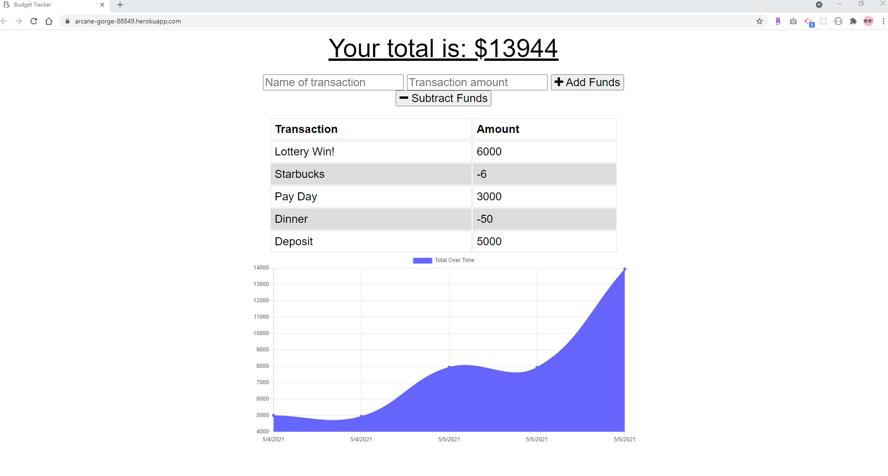
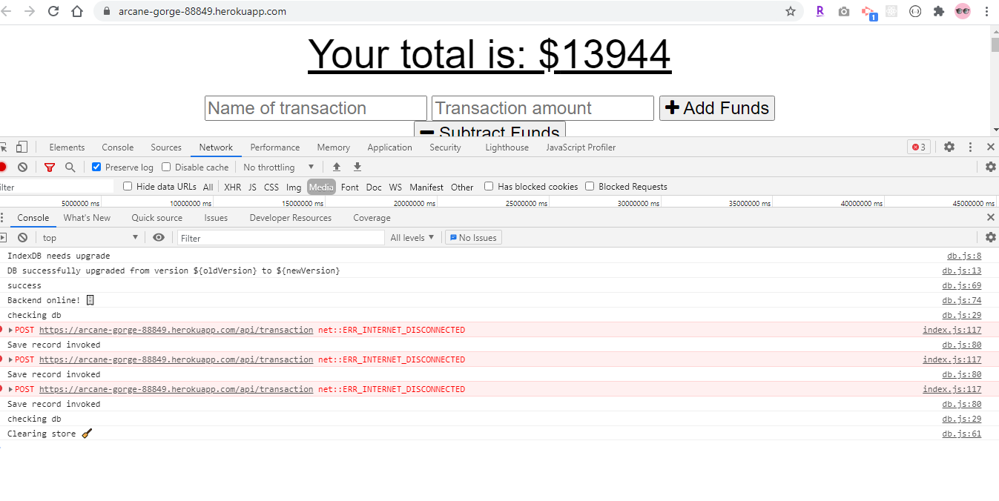

<h1 align="center">Welcome to Offline-Online Budget Tracker 👋</h1>
<p>
  
  <a href="https://github.com/coding-boot-camp/unit18hw/graphs/commit-activity" target="_blank">
    
  </a>
  <a href="https://opensource.org/licenses/MIT" target="_blank">
    
  </a>
</p>


## Table of Contents
  - [Description](#description)
  - [Homepage](#homepage)
  - [Installation](#installation)
  - [Usage](#usage)
  - [Author](#author)
  - [Contributions](#contribution)
  - [License](#license)

  ## Description
> indexDB is used to capture offline budget entries to be applied to app when app is online.

## 🏠 [Homepage](https://github.com/kcnancy/Online_Offline_Budget_Trackers)

## ✨ [Demo](https://arcane-gorge-88849.herokuapp.com/)

## Install

```sh
npm install
```

## Usage

```sh
npm run start
```




## Author
👤 **Nancy McBride**

* Website: https://kcnancy.github.io/NancyMcBride-Portfolio/
* Github: [@kcnancy](https://github.com/kcnancy)
* LinkedIn: [@Nancy McBride](https://linkedin.com/in/Nancy McBride)

## Show your support

Give a ⭐️ if this project helped you!

## 📝 License

Copyright © 2021 [Nancy McBride](https://github.com/kcnancy).<br />
This project is [MIT](https://opensource.org/licenses/MIT) licensed.

***
_This README was generated with ❤️ by [readme-md-generator](https://github.com/kefranabg/readme-md-generator)_